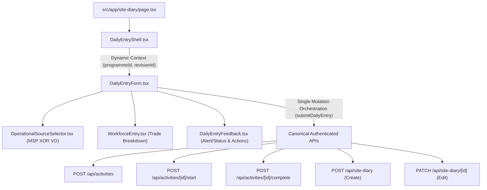

# F2.1 — DAILY ENTRY UX CLOSURE REPORT

**Repository:** `jenggon/jkr-site-diary`  
**Branch:** `feature/F2.1-daily-entry-ux`  
**Target:** `develop` (Draft PR #16)  
**Status:** COMPLETE / READY FOR HQ CLOSURE REVIEW  
**Architecture Authority:** DB-014 / DB-015 / REM-007 / ADR-F1-001  

---

## 1. Scope Completed: Packages F2.1-A through F2.1-G

| Package | Objective | Status | Proof |
|---|---|---|---|
| **F2.1-A** | Daily Entry Shell & Canonical Programme Discovery (`GET /api/programme`) | **COMPLETE** | `tests/unit/ui/dailyEntryShell.test.ts` |
| **F2.1-B** | MSP XOR VO Operational Source Selection (`OperationalSourceSelector.tsx`) | **COMPLETE** | `tests/unit/ui/operationalSourceSelector.test.ts` |
| **F2.1-C** | Unified Native Mutation Orchestration (`DailyEntryForm.tsx`) | **COMPLETE** | `tests/integration/ui/dailyEntryParity.test.ts` |
| **F2.1-D** | Mobile-First Workforce & Trade Allocation (`WorkforceEntry.tsx`) | **COMPLETE** | `tests/unit/ui/workforceEntry.test.ts` |
| **F2.1-E** | Feedback, Validation, Double-Submit Lock, & 401 Session UX (`DailyEntryFeedback.tsx`) | **COMPLETE** | `tests/integration/ui/dailyEntryFeedback.test.ts` |
| **F2.1-F** | Persistent Context, Fluid Navigation, & Post-Save Reset/Print Flow | **COMPLETE** | `tests/integration/ui/dailyEntryNavigationFlow.test.ts` |
| **F2.1-G** | Legacy Dead-Code Elimination, Context Sweeps, & 26-Point Master Regression | **COMPLETE** | `tests/integration/ui/f21MasterRegression.test.ts` |

---

## 2. Final Native Runtime Architecture

The active Daily Entry product surface is structured into a clean, unidirectional component hierarchy:



---

## 3. Programme Context Authority

- **Endpoint:** `GET /api/programme?status=Active` is the canonical discovery authority.
- **Dynamic Resolution:**
  - **0 Programmes:** Surfaces explicit empty state prompting system setup.
  - **1 Programme:** Auto-selects that active programme and queries its summary (`GET /api/project-summary?programmeId=...`).
  - **>1 Programmes:** Presents dynamic selection cards, requiring explicit user choice before loading form state.
- **Context Sweeps:** All hardcoded UUID constants (`DEFAULT_PROGRAMME_ID`, `0651e125...`) are eliminated from active client runtime.

---

## 4. MSP XOR VO Operational Source Behaviour

- A Site Diary Activity originates from **exactly ONE** operational source:
  - **MSP Task:** Requires `taskId` (maps to MS Project schedule task under the active revision).
  - **VO Item:** Requires `voItemId` (maps to Variation Order APK record registered for the active revision).
- The outbound payload strictly contains `sourceType: 'MSP' | 'VO'` and either `taskId` or `voItemId`.

---

## 5. Activity Lifecycle Behaviour

- Activity operational state is governed canonically by `activity` (DB-014):
  - **Known Start Date:** Uses user-selected `actualStartDate` passed into `/start` or `/complete`.
  - **In Progress:** Triggers `POST /api/activities/[activityId]/start`.
  - **Completed (Siap):** Triggers `POST /api/activities/[activityId]/start` followed by `POST /api/activities/[activityId]/complete` (supporting same-day start & complete).
  - **Fail-Fast Safety:** If any lifecycle transition fails, Site Diary persistence is aborted immediately.

---

## 6. Site Diary Create / Edit Identity

- **CREATE (`isEditMode = false`):** Dispatches `POST /api/site-diary` creating a new entry with generated `site_diary_id`.
- **EDIT (`isEditMode = true`):** Dispatches `PATCH /api/site-diary/[siteDiaryId]`, preserving existing `site_diary_id` identity. Never falls back to POST.
- **Duplicate Protection:** Unique database constraints on `(activity_id, activity_date)` are surfaced with localized message: `"Laporan untuk aktiviti ini pada tarikh [date] telah wujud."` without secondary retry cascades.

---

## 7. Workforce & Trade Behaviour

- **Atomic Payload:** Workforce trade counts are submitted inline with the Site Diary payload under the canonical `manpower` array.
- **Demographic Split:** Per-trade breakdown of Bumiputera, Bukan Bumiputera, and Bukan Warganegara with non-negative integer validation.
- **Standard Catalog & Custom Trades:** Pre-populated with standard Malaysian JKR trades with custom trade write-in support and duplicate prevention.

---

## 8. Feedback & Navigation UX

- **Accessible Status:** Error alerts use `role="alert"` / `aria-live="assertive"`; success feedback uses `role="status"` / `aria-live="polite"`.
- **Concurrency Protection:** Synchronous ref lock (`isSubmittingRef`) and disabled submit button (`aria-disabled="true"`) prevent double-tap submissions.
- **Post-Save Actions:**
  - `Lihat Format JKR (Print)` &rarr; links to `/site-diary/print?id=${savedSiteDiaryId}`.
  - `+ Laporan Baharu` &rarr; safely resets transient form state for consecutive daily logging.
- **Auth Expiry:** Maps 401 unauthenticated responses directly to localized re-login feedback.

---

## 9. Legacy Asset Governance

| File | Classification | Resolution | Rationale |
|---|---|---|---|
| `src/app/site-diary/F1GoldenPathBridge.tsx` | **Class C (Fully Superseded / Dead)** | **DELETED** | Bridge monkey-patching `window.fetch` is completely replaced by native orchestration in `DailyEntryForm.tsx`. |
| `src/app/site-diary/LegacySiteDiaryPage.tsx` | **Class C (Fully Superseded / Dead)** | **DELETED** | Monolithic legacy view is 100% superseded by modular Daily Entry components. |

---

## 10. Mandatory 26-Point Final Regression Matrix

| # | Contract Requirement | Proof Test File | Result |
|---|---|---|---|
| 1 | Dynamic Programme discovery | `tests/unit/ui/dailyEntryShell.test.ts` | **PASS** |
| 2 | 0 / 1 / multiple Programme behaviour | `tests/unit/ui/dailyEntryShell.test.ts` | **PASS** |
| 3 | Current authorised Revision context | `tests/integration/ui/dailyEntryNavigationFlow.test.ts` | **PASS** |
| 4 | MSP source selection | `tests/unit/ui/operationalSourceSelector.test.ts` | **PASS** |
| 5 | VO source selection | `tests/unit/ui/operationalSourceSelector.test.ts` | **PASS** |
| 6 | MSP XOR VO payload integrity | `tests/integration/ui/dailyEntryParity.test.ts` | **PASS** |
| 7 | Known Start Date semantics | `tests/integration/ui/dailyEntryParity.test.ts` | **PASS** |
| 8 | In Progress lifecycle | `tests/integration/ui/dailyEntryParity.test.ts` | **PASS** |
| 9 | Same-day start + complete | `tests/integration/ui/dailyEntryParity.test.ts` | **PASS** |
| 10 | Lifecycle failure blocks Site Diary write | `tests/integration/ui/dailyEntryFeedback.test.ts` | **PASS** |
| 11 | Site Diary CREATE | `tests/integration/ui/dailyEntryParity.test.ts` | **PASS** |
| 12 | Site Diary EDIT preserving ID | `tests/integration/ui/dailyEntryParity.test.ts` | **PASS** |
| 13 | Duplicate Diary protection | `tests/integration/ui/dailyEntryFeedback.test.ts` | **PASS** |
| 14 | Workforce atomic payload | `tests/unit/ui/workforceEntry.test.ts` | **PASS** |
| 15 | Workforce totals / validation | `tests/unit/ui/workforceEntry.test.ts` | **PASS** |
| 16 | print_context persistence | `tests/integration/ui/dailyEntryParity.test.ts` | **PASS** |
| 17 | Create success feedback | `tests/integration/ui/dailyEntryFeedback.test.ts` | **PASS** |
| 18 | Edit success feedback | `tests/integration/ui/dailyEntryFeedback.test.ts` | **PASS** |
| 19 | Double-submit protection | `tests/integration/ui/dailyEntryFeedback.test.ts` | **PASS** |
| 20 | 401/session feedback | `tests/integration/ui/dailyEntryFeedback.test.ts` | **PASS** |
| 21 | Programme change clears stale source | `tests/integration/ui/dailyEntryNavigationFlow.test.ts` | **PASS** |
| 22 | Laporan Baharu reset | `tests/integration/ui/dailyEntryNavigationFlow.test.ts` | **PASS** |
| 23 | Print handoff with saved ID | `tests/integration/ui/dailyEntryNavigationFlow.test.ts` | **PASS** |
| 24 | No hardcoded Programme identity | `tests/integration/ui/dailyEntryNavigationFlow.test.ts` | **PASS** |
| 25 | No retired bridge interception | `tests/integration/ui/f21MasterRegression.test.ts` | **PASS** |
| 26 | Exactly one active mutation path | `tests/integration/ui/f21MasterRegression.test.ts` | **PASS** |

---

## 11. Preflight Verification Result (`CI-HARDEN-001`)

```bash
pnpm run verify
```

- **verify:lockfile:** Clean & synchronized
- **typecheck:** 0 errors
- **typecheck:api:** 0 errors
- **lint:** 0 errors
- **test:** **72 test files passed, 395 unit & integration tests passed (100%)**
- **build:** Next.js production build compiled cleanly across all 29 routes

---

## 12. Explicit Deferred Scopes

The following scopes are intentionally **NOT** absorbed in F2.1 and remain governed for subsequent checkpoints:
- **F2.2:** Open Activities UX
- **F2.3:** Diary Management & Audit History
- **F2.4:** Approval Workflow UX
- **F2.5:** Print Experience & Continuation Pages
- **F2.6:** Product Integration
- **F2.7:** Final Acceptance

---

## 13. Closure Recommendation

Feature Package **F2.1 (Daily Entry UX)** has fulfilled all architectural, behavioral, and verification requirements with zero regressions and zero legacy runtime dependencies. It is recommended for full closure review and acceptance by HQ.
