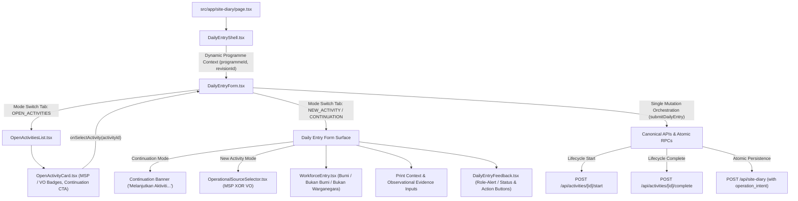

# F2.2 — OPEN ACTIVITIES UX CLOSURE REPORT

**Repository:** `jenggon/jkr-site-diary`  
**Branch:** `feature/F2.2-open-activities-ux`  
**Target:** `develop` (Draft PR #17)  
**Status:** COMPLETE / READY FOR HQ CLOSURE REVIEW  
**Architecture Authority:** DB-014 / DB-015 / REM-006 / REM-007 / ADR-F1-001  

---

## 1. Executive Summary

Feature **F2.2 (Open Activities UX)** delivers the canonical bridge between operational CPM/VO Activity state (`activity`) and daily execution logging (`site_diary`). It introduces a revision-safe Open Activity projection, safe Activity continuation prefilling, atomic database-governed lifecycle intent enforcement, and robust asynchronous UI authority with generation-token race protection.

All packages (**F2.2-A**, **B01**, **B02**, **B03**, and **B04**) have completed development, strict local verification, independent adversarial audits, and end-to-end CI preflight testing (`pnpm run verify`).

---

## 2. Authoritative Baseline

- **Base Commit:** `origin/develop @ 9520fccb9bcadfc5ea8525866349e0e4d7ec5b03` (F2.1 post-merge CI green baseline)
- **Draft PR:** #17 — *F2.2 — Open Activities UX*
- **Final Working Branch HEAD:** `17a109513a12f101f0edd71b59211d07fdb34ca2`

---

## 3. Scope Completed: Packages F2.2-A through F2.2-B04

| Package | Focus Area | Status | Key Deliverable / Proof |
|---|---|---|---|
| **F2.2-A** | Architectural Reconnaissance & Implementation Contract | **ACCEPTED** | `F2.2-OPEN-ACTIVITIES-UX-RECON-AND-CONTRACT.md` |
| **F2.2-B01** | Revision-Safe Open Activity Projection | **ACCEPTED** | Authorized CPM Revision locking in `OpenActivityService.ts` & `GET /api/activities/open` |
| **F2.2-B02** | Existing Activity Continuation Mode & Atomic DB Lifecycle Intent | **ACCEPTED** | Atomic `operation_intent` RPC validation, completion recovery, strict form-mode XOR |
| **F2.2-B03** | Open Activities UI & Continuation Handoff (+ Async Race Remediation) | **ACCEPTED** | `OpenActivitiesList.tsx`, `OpenActivityCard.tsx`, centralized continuation invalidation |
| **F2.2-B04** | Final Regression, Closure & PR Preparation | **COMPLETE** | 46-point regression proof, lockfile hygiene, full verification pass |

---

## 4. Final Runtime Architecture

The unified Daily Entry & Open Activities UX runtime operates in a unidirectional, context-governed architecture:



---

## 5. Open Activity Definition

- **Canonical Ownership:** Under DB-014 / DB-015 and REM-007, `activity` is the canonical persistence owner of operational activity state. **There is no separate `open_activity` database table or entity.**
- **Operational Definition:** An Open Activity is an operational read projection querying `activity` rows for a specific `programme_id` that belong to the **currently authorized CPM revision** and possess an active operational status (`New` or `In Progress`).
- **Exclusion Invariants:** `Completed` activities and activities belonging to superseded, draft, or archived CPM revisions are strictly excluded from the Open Activities projection.

---

## 6. Revision-Safe Projection (B01)

- **Endpoint:** `GET /api/activities/open?programmeId=<UUID>`
- **Authoritative Resolution:** `OpenActivityService.getOpenActivitiesByProgramme(programmeId)` queries `ProgrammeRevisionRepository` to identify the single authorized revision (`is_authorized: true, is_current: true`).
- **Exclusion of Superseded Revisions:** Superseded revisions cannot be queried or injected by client-side overrides. If a programme has no authorized revision, the projection returns an empty array `[]` cleanly.
- **Polymorphic Source Support:** Accurately projects both schedule activities (`MSP`) and approved variation orders (`VO`).

---

## 7. Continuation Lifecycle Matrix (B02)

Every form submission executes a deterministic lifecycle transition before Site Diary persistence:

| Form Mode | Work Status Input | Activity Creation | Lifecycle Transition | Operation Intent Dispatched |
|---|---|---|---|---|
| **NEW_ACTIVITY** | `Sedang Laksana` | Creates `activity` (`New`) | Dispatches `POST /start` &rarr; `In Progress` | `IN_PROGRESS_DIARY` |
| **NEW_ACTIVITY** | `Siap` | Creates `activity` (`New`) | Dispatches `POST /start` then `/complete` | `FINAL_COMPLETION_DIARY` |
| **CONTINUE (New)** | `Sedang Laksana` | Reuses `editingActivityId` | Dispatches `POST /start` &rarr; `In Progress` | `IN_PROGRESS_DIARY` |
| **CONTINUE (New)** | `Siap` | Reuses `editingActivityId` | Dispatches `POST /complete` (canonical) | `FINAL_COMPLETION_DIARY` |
| **CONTINUE (In Progress)** | `Sedang Laksana` | Reuses `editingActivityId` | **No `/start` replay** (retains status) | `IN_PROGRESS_DIARY` |
| **CONTINUE (In Progress)** | `Siap` | Reuses `editingActivityId` | Dispatches `POST /complete` &rarr; `Completed` | `FINAL_COMPLETION_DIARY` |
| **EDIT_SITE_DIARY** | Any | Reuses `editingSiteDiaryId` | **Zero lifecycle mutation** (PATCH only) | N/A (`PATCH /api/site-diary/[id]`) |

---

## 8. Closed Operation-Intent Contract

- **Intent Union:**
  1. `IN_PROGRESS_DIARY` — Requires Activity status `In Progress`.
  2. `FINAL_COMPLETION_DIARY` — Requires Activity status `Completed` AND exact match between `activity.completed_date` and `site_diary.activity_date`.
  3. `CARRY_FORWARD_DIARY` — Requires explicit `carry_forward: true` and operational status (`New` or `In Progress`).
- **Database Authority:** The atomic RPC `create_site_diary_entry_atomic` strictly validates `operation_intent` within the database transaction lock. Any missing, null, or mismatched intent fails closed and rolls back the transaction.

---

## 9. Continuation Prefill Contract

When continuing an existing Activity:
- **Safely Copied (Operational Memory):**
  - Most recent prior `manpower` allocation (trade names and count breakdowns).
  - Most recent prior `print_context.location` (grid lines / work area).
  - Most recent prior `print_context.contractor_scope` (`CONTRACTOR` vs `NSC`).
- **Explicitly Reset (Observational Day-Specific Evidence):**
  - `weatherCondition` &rarr; reset to `null` / `'ELOK'`.
  - `workStartTime` / `workEndTime` &rarr; reset to defaults (`'08:00'`, `'17:00'`).
  - `rainStartTime` / `rainEndTime` &rarr; reset to `''`.
  - `notes` &rarr; reset to `''`.
  - Prior diaries with `activity_date >= targetDate` are strictly excluded from prefill evaluation.

---

## 10. Open Activities UX (B03)

- **`OpenActivitiesList.tsx`:** Renders responsive cards with loading skeleton, empty state (with CTA to create new entry), and error/retry surfaces.
- **`OpenActivityCard.tsx`:** Displays subtask name, AHI breadcrumbs, operational source badge (`MSP` vs `VO`), lifecycle status badge (`Belum Mula` vs `Sedang Laksana`), and primary "Sambung Laporan" CTA.
- **Accessibility:** Semantic ARIA roles (`role="tablist"`, `role="tab"`, `role="tabpanel"`, `aria-selected`, `aria-controls`, `aria-labelledby`) link mode navigation tabs directly to active views.

---

## 11. Async Race-Authority Model (B03R / B03R2)

To prevent race conditions, out-of-order responses, and unmount state leaks:
- **Request Generation Tokens:** `activeRequestRef` and `continuationPrefillGenerationRef` track monotonically increasing generation IDs. Any response resolving after a newer request or tab exit is discarded silently.
- **In-Flight Cancellation:** `AbortController` instances actively abort pending network fetches on parameter changes or unmount.
- **Centralized Invalidation:** A single `invalidateContinuationContext()` handler manages all exit paths (Back to Open Activities, post-save return, Programme change, and New Activity reset), ensuring no stale prefill can overwrite clean form state.

---

## 12. Workforce and Auth Preservation

- **Workforce Persistence:** Multi-trade allocations remain atomic with Site Diary creation and updates. Demographic splits (`bumi_count`, `non_bumi_count`, `foreign_count`) are validated non-negative integers.
- **Server-Side Actor Authority:** Actor identity (`created_by`, `updated_by`) is strictly derived from the authenticated Supabase JWT session server-side. No client-spoofed actor parameters exist in payloads.
- **Zero Browser Direct Mutations:** All mutations flow exclusively through Next.js API routes with service-layer validation.

---

## 13. Final 46-Point F2.2 Regression Matrix

| # | Invariant / Requirement | Verification Test Suite | Result |
|---|---|---|---|
| 1 | Dynamic Programme discovery & context | `tests/unit/ui/dailyEntryShell.test.ts` | **PASS** |
| 2 | Current authorised CPM revision isolation | `tests/integration/api/openActivityProjection.test.ts` | **PASS** |
| 3 | New Open Activities returned in projection | `tests/integration/api/openActivitiesRoute.integration.test.ts` | **PASS** |
| 4 | In Progress Open Activities returned | `tests/unit/services/OpenActivityService.test.ts` | **PASS** |
| 5 | Completed Activities excluded from Open projection | `tests/integration/api/openActivityProjection.test.ts` | **PASS** |
| 6 | Superseded CPM revisions excluded from Open projection | `tests/integration/api/openActivityProjection.test.ts` | **PASS** |
| 7 | MSP schedule identity preserved (`taskId`, WBS) | `tests/integration/ui/openActivitiesUi.test.ts` | **PASS** |
| 8 | VO APK identity preserved (`voItemId`, APK reference) | `tests/integration/ui/openActivitiesUi.test.ts` | **PASS** |
| 9 | Mobile-first Open Activities card grid | `tests/integration/ui/openActivitiesUi.test.ts` | **PASS** |
| 10 | Open Activities loading state | `tests/integration/ui/openActivitiesUi.test.ts` | **PASS** |
| 11 | Open Activities empty state + Create New CTA | `tests/integration/ui/openActivitiesUi.test.ts` | **PASS** |
| 12 | Open Activities error & retry handling | `tests/integration/ui/openActivitiesUi.test.ts` | **PASS** |
| 13 | Exact Activity continuation handoff | `tests/integration/ui/dailyEntryContinuationMode.test.ts` | **PASS** |
| 14 | Activity selection performs zero mutation | `tests/integration/ui/openActivitiesUi.test.ts` | **PASS** |
| 15 | Existing New + Sedang &rarr; `/start` + `IN_PROGRESS_DIARY` | `tests/integration/ui/dailyEntryContinuationMode.test.ts` | **PASS** |
| 16 | Existing New + Siap &rarr; `/complete` + `FINAL_COMPLETION_DIARY` | `tests/integration/ui/dailyEntryContinuationMode.test.ts` | **PASS** |
| 17 | Existing InProgress + Sedang &rarr; NO `/start` replay | `tests/integration/ui/dailyEntryContinuationMode.test.ts` | **PASS** |
| 18 | Existing InProgress + Siap &rarr; `/complete` + `FINAL_COMPLETION_DIARY` | `tests/integration/ui/dailyEntryContinuationMode.test.ts` | **PASS** |
| 19 | Completed Activity fails closed | `tests/integration/api/siteDiaryIntentContract.test.ts` | **PASS** |
| 20 | No duplicate Activity creation on continuation | `tests/integration/ui/dailyEntryContinuationMode.test.ts` | **PASS** |
| 21 | Exact `activity_id` reuse on continuation | `tests/integration/ui/dailyEntryContinuationMode.test.ts` | **PASS** |
| 22 | Prior-diary prefill selection strictly by date | `tests/integration/ui/dailyEntryContinuationMode.test.ts` | **PASS** |
| 23 | Future/current date diaries excluded from prefill | `tests/integration/ui/dailyEntryContinuationMode.test.ts` | **PASS** |
| 24 | Manpower copied on continuation prefill | `tests/integration/ui/dailyEntryContinuationMode.test.ts` | **PASS** |
| 25 | Location copied on continuation prefill | `tests/integration/ui/dailyEntryContinuationMode.test.ts` | **PASS** |
| 26 | Contractor scope copied on continuation prefill | `tests/integration/ui/dailyEntryContinuationMode.test.ts` | **PASS** |
| 27 | Observational evidence reset on continuation | `tests/integration/ui/dailyEntryContinuationMode.test.ts` | **PASS** |
| 28 | Exact Site Diary edit identity preservation | `tests/integration/ui/dailyEntryParity.test.ts` | **PASS** |
| 29 | PATCH edit never falls back to POST | `tests/integration/ui/dailyEntryParity.test.ts` | **PASS** |
| 30 | Closed operation intent union enforcement | `tests/integration/api/siteDiaryIntentContract.test.ts` | **PASS** |
| 31 | Missing or null operation intent rejected | `tests/integration/api/siteDiaryIntentContract.test.ts` | **PASS** |
| 32 | Wrong completion date on final intent rejected | `tests/integration/api/siteDiaryIntentContract.test.ts` | **PASS** |
| 33 | Carry-forward requires explicit intent & flag | `tests/integration/api/siteDiaryIntentContract.test.ts` | **PASS** |
| 34 | Programme A&rarr;B list stale success/error race protection | `tests/integration/ui/openActivitiesLifecycleRaces.test.ts` | **PASS** |
| 35 | Activity A&rarr;B prefill race protection (manpower/identity) | `tests/integration/ui/openActivitiesLifecycleRaces.test.ts` | **PASS** |
| 36 | Back button invalidates pending prefill & resets form | `tests/integration/ui/openActivitiesLifecycleRaces.test.ts` | **PASS** |
| 37 | Programme switch invalidates continuation context | `tests/integration/ui/openActivitiesLifecycleRaces.test.ts` | **PASS** |
| 38 | Post-save navigation uses centralized invalidation | `tests/integration/ui/openActivitiesLifecycleRaces.test.ts` | **PASS** |
| 39 | Workforce atomic persistence with Site Diary | `tests/unit/ui/workforceEntry.test.ts` | **PASS** |
| 40 | `print_context` persistence preserved | `tests/integration/ui/dailyEntryParity.test.ts` | **PASS** |
| 41 | Server-derived actor identity (no client spoof) | `tests/unit/api/siteDiaryApi.test.ts` | **PASS** |
| 42 | MSP XOR VO operational source exclusivity | `tests/unit/ui/operationalSourceSelector.test.ts` | **PASS** |
| 43 | F2.1 New Entry path 100% preserved | `tests/integration/ui/f21MasterRegression.test.ts` | **PASS** |
| 44 | No hardcoded Programme or Revision UUIDs | `tests/integration/ui/dailyEntryNavigationFlow.test.ts` | **PASS** |
| 45 | No separate `open_activity` table or entity | `tests/unit/rem005OpenActivityApiSchema.test.ts` | **PASS** |
| 46 | No direct browser database mutations | `tests/integration/ui/dailyEntryFeedback.test.ts` | **PASS** |

---

## 14. Verification Result (`CI-HARDEN-001`)

The repository preflight command was executed:

```bash
pnpm run verify
```

### Verification Breakdown:
1. **Lockfile Consistency (`verify:lockfile`):** `pnpm install --frozen-lockfile --lockfile-only --ignore-scripts` &rarr; **PASSED** (0 errors).
2. **TypeScript Validation (`typecheck`):** `tsc --noEmit` &rarr; **PASSED** (0 errors).
3. **API TypeScript Validation (`typecheck:api`):** `tsc --noEmit -p tsconfig.api.json` &rarr; **PASSED** (0 errors).
4. **Linting (`lint`):** `eslint .` &rarr; **PASSED** (0 errors).
5. **Full Automated Test Suite (`test`):** `vitest run` &rarr; **PASSED** (**77 test files, 479 tests passed**).
6. **Production Build (`build`):** `next build` &rarr; **PASSED** (29 static routes compiled).

---

## 15. Dependency and Test Classification

- **Mounted Component Lifecycle Tests (`jsdom` + `createRoot` + `act`):** `openActivitiesLifecycleRaces.test.ts` mounts real React 19 components with deferred promises to test asynchronous UI lifecycles and race conditions.
- **UI Behavioral Integration Tests:** `openActivitiesUi.test.ts`, `dailyEntryContinuationMode.test.ts`, `dailyEntryFeedback.test.ts`, `dailyEntryNavigationFlow.test.ts`, `dailyEntryParity.test.ts`, `f21MasterRegression.test.ts`.
- **API Route Integration Tests:** `siteDiaryApi.integration.test.ts`, `openActivitiesRoute.integration.test.ts`, `openActivityProjection.test.ts`, `siteDiaryIntentContract.test.ts`.
- **Service Unit Tests:** `OpenActivityService.test.ts`, `ProgrammeService.test.ts`, `TreEngineService.test.ts`, `workforceService.test.ts`.
- **Important Testing Reality:** Mocked RPC unit/integration tests validate service and handler contracts against mock adapters; live database transactions are validated against PostgreSQL schema definitions (`baseline.sql`).

---

## 16. Explicit Deferred Scope (F2.3 &ndash; F2.7)

The following modules are explicitly out of scope for F2.2 and preserved for subsequent packages:
- **F2.3 — Diary Management / History:** Historical log explorer, append-only audit trail viewers (`site_diary_logs`), batch filtering.
- **F2.4 — Approval UX:** SO / SO Representative verification workflows, submission lock states.
- **F2.5 — Print Experience / Continuation Pages:** Locked JKR Page 1 layout, multi-page continuation rendering for workforce/materials overflow.
- **F2.6 — Product Integration:** Navigation unification across JKR Site Diary suite.
- **F2.7 — Final Acceptance:** Full end-to-end user acceptance testing with official sample fixtures.

---

## 17. Known Non-Blocking Observations

- **Edit Redundant Fetch Guard:** Decoupled `initialSiteDiaryId` from `activityDate` state updates to avoid secondary re-fetches during Site Diary edits.
- **Dependency State:** `jsdom` is maintained as the single DOM testing library in devDependencies; `happy-dom` resolved snapshots have been fully purged from the lockfile.

---

## 18. F2.2 Closure Recommendation

Feature **F2.2 — Open Activities UX** has met all architectural constraints (DB-014, DB-015, REM-006, REM-007), closed-intent lifecycle contracts, and strict async UI race requirements.

**Recommendation:** **APPROVE AND CLOSE F2.2.** Draft PR #17 is ready for HQ final closure review.
