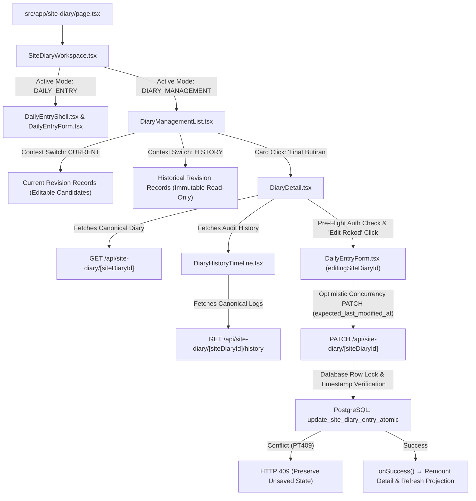

# F2.3 — DIARY MANAGEMENT / HISTORY CLOSURE REPORT

**Repository:** `jenggon/jkr-site-diary`  
**Branch:** `feature/F2.3-diary-management-history`  
**Target:** `develop` (Draft PR #18)  
**Status:** COMPLETE / READY FOR HQ CLOSURE REVIEW  
**Architecture Authority:** DB-014 / DB-015 / REM-006 / REM-007 / ADR-F1-001  

---

## 1. Executive Summary

Feature **F2.3 (Diary Management / History)** provides the complete operational and historical management subsystem for the JKR Site Diary module. It establishes:
1. **Revision-Safe Read Projections:** High-performance, read-only projection across current and historical/superseded CPM revisions without operational contamination.
2. **Optimistic Concurrency Control:** Strict token-governed (`expected_last_modified_at`) collision prevention at the database transaction layer, eliminating lost updates.
3. **Current & Historical Management UX:** Mobile-first, responsive navigation interface supporting multi-dimensional filtering (search, dates, source, scope) and clear visual segregation between editable current records and immutable historical revisions.
4. **Canonical Detail & Protected Edit Handoff:** Strict identity cross-checking, pre-flight authority revalidation, zero lifecycle replay, and seamless handoff into the canonical `DailyEntryForm` editing engine.
5. **Audit Timeline & Derived Diff Engine:** Chronological, record-level audit trail (`site_diary_logs`) leveraging post-mutation snapshots to compute human-readable field and workforce diffs on-the-fly with case-insensitive trade normalization and UUID actor suppression.

All packages (**F2.3-A**, **B01**, **B02**, **B03**, **B04**, **B05**, and **B06**) have completed development, strict local verification, independent adversarial audits, and end-to-end CI preflight testing (`pnpm run verify`).

---

## 2. Authoritative Baseline

- **Base Commit:** `origin/develop @ 98068ab529aed904c539bf41533a7cf9f4c8075f` (F2.2 post-merge CI green baseline)
- **Draft PR:** #18 — *F2.3 — Diary Management / History*
- **Final Working Branch HEAD:** `a4a486d3bc8afce2648445ce1cc949ef08f0aa79`

---

## 3. Scope Completed: Packages F2.3-A through F2.3-B06

| Package | Focus Area | Status | Key Deliverables & Contracts |
|---|---|---|---|
| **F2.3-A** | Architectural Reconnaissance & Contract | **ACCEPTED** | `F2.3-DIARY-MANAGEMENT-HISTORY-RECON-AND-CONTRACT.md` |
| **F2.3-B01** | Revision-Safe Read Projection | **ACCEPTED** | `SiteDiaryManagementReadRepository.ts`, `SiteDiaryManagementReadService.ts`, `GET /api/site-diary/revision/[revisionId]` |
| **F2.3-B02** | Optimistic Concurrency / Stale Edit Protection | **ACCEPTED** | Migration `20260818093000_f2_3_site_diary_optimistic_concurrency.sql`, `expected_last_modified_at` check in `ResidualAtomicRepository.ts`, HTTP 409 handling |
| **F2.3-B03** | Mobile Diary Management List (Current + History UX) | **ACCEPTED** | `SiteDiaryWorkspace.tsx`, `DiaryManagementList.tsx`, filter engine, async generation guards |
| **F2.3-B04** | Canonical Detail + Protected Edit Handoff | **ACCEPTED** | `DiaryDetail.tsx`, identity cross-check, pre-flight authority revalidation, zero-lifecycle edit handoff |
| **F2.3-B05** | Site Diary Audit Timeline + Derived Diff | **ACCEPTED** | `SiteDiaryHistoryRepository.ts`, `SiteDiaryHistoryService.ts`, `GET /api/site-diary/[id]/history`, `DiaryHistoryTimeline.tsx` |
| **F2.3-B06** | Final Regression, Closure & PR Preparation | **COMPLETE** | 70-point regression matrix, full verification pass (`pnpm run verify`), PR #18 preparation |

---

## 4. Final Runtime Architecture

The unified F2.3 Diary Management subsystem operates in a modular, unidirectional architecture:



---

## 5. Historical Read vs. Current Edit Authority

- **Read Authority Model:** Any authenticated user with project access can inspect diary records belonging to **any** revision (Current, Approved, Superseded, Archived) via `GET /api/site-diary/revision/[revisionId]` and `GET /api/site-diary/[siteDiaryId]`. Historical records are never hidden or blocked from inspection.
- **Edit Authority Model:** Only diary records belonging to the **currently active, authorized CPM revision** (`isCurrentRevision: true, revisionStatus: 'Approved', isReadOnly: false`) are eligible for mutation.
- **Runtime Guarding:** Even if a list projection indicates editable status, `DiaryDetail` executes a mandatory network pre-flight re-check against `/api/programme-revision` when the user clicks "Edit Rekod". If the revision was superseded while the view was open, mutation handoff is blocked immediately with `"Rekod ini kini sejarah dan hanya boleh dibaca."`

---

## 6. Read Projection (B01)

- **Repository & Service:** `SiteDiaryManagementReadRepository` and `SiteDiaryManagementReadService` execute an enriched join between `site_diary`, `activity`, `task`, and `vo_items`.
- **Source Polymorphism:** Accurately projects schedule activities (`MSP`) and variation order items (`VO`) with correct WBS / APK identifiers.
- **Deterministic Ordering:** Results are ordered deterministically by `activity_date DESC`, `submitted_at DESC`, `site_diary_id ASC`.
- **Fault-Tolerant Fallbacks:** If operational activity or enrichment metadata is missing or partial, the projection fails safe with neutral fallbacks (`"Maklumat aktiviti tidak tersedia"`, `"Tidak tersedia"`) without crashing the endpoint.

---

## 7. Optimistic Concurrency Control (B02)

- **Database Token Enforcement:** Concurrency validation is enforced inside `ResidualAtomicRepository.updateSiteDiaryEntry` within the transaction lock (`SELECT ... FOR UPDATE`).
- **Canonical Token Derivation:** `canonical_token = COALESCE(updated_at, submitted_at)`.
- **Conflict Handling:** If `expected_last_modified_at` does not match `canonical_token`, the database transaction immediately raises exception `PT409: Site diary was modified by another transaction`, aborting before modifying `site_diary`, `site_diary_manpower`, `site_diary_print_context`, `site_diary_logs`, or `audit_trail`.
- **Zero Fallback POST:** A 409 conflict returns HTTP 409 to the frontend. The `DailyEntryForm` remains mounted, unsaved user input is preserved, an explicit warning alert is displayed, and no silent POST or overwriting occurs.

---

## 8. Current / Historical Management UX (B03)

- **Workspace Navigation:** `SiteDiaryWorkspace` toggles between the operational Daily Entry engine and Diary Management via accessible tab controls.
- **Context Tabs:** `DiaryManagementList` offers distinct "Rekod Semasa" and "Semakan Terdahulu" browsing modes with clear color-coded badges (`Sejarah / Baca Sahaja`).
- **Filter Engine:** Real-time client/server filtering across search text, start/end dates, operational source (`MSP` / `VO`), and contractor scope (`CONTRACTOR` / `NSC`).
- **Privacy & Hygiene:** Zero raw UUIDs exposed as primary labels; all identifiers are presented with human-readable titles, dates, and Malaysian formatted timestamps.

---

## 9. Canonical Detail Surface (B04)

- **Canonical Grounding:** `DiaryDetail.tsx` fetches the authoritative record via `GET /api/site-diary/[siteDiaryId]`, ensuring full fidelity for print context, notes, and workforce distributions.
- **Identity Cross-Checking:** Validates that `canonical.site_diary_id === projection.siteDiaryId`, `canonical.programme_id === workspace.programmeId`, `canonical.revision_id === projection.revisionId`, and `canonical.activity_id === projection.activityId`. Any mismatch fails closed immediately.
- **Historical Immutability:** When viewing historical records, the "Edit Rekod" CTA is completely omitted from the DOM.

---

## 10. Edit Handoff & Lifecycle Isolation (B04)

- **Exact Identity Handoff:** Passes exact `site_diary_id` directly to `DailyEntryForm`.
- **Zero Lifecycle Replay:** Operates strictly with `editingSiteDiaryId` (`editingActivityId = null`), preventing any unintended calls to `/start`, `/complete`, or `POST /activities`.
- **Safe Cancel / Back:** Cancel unmounts the form, discards local form drafts, and remounts `DiaryDetail` cleanly with zero database mutations.
- **Post-Edit Refresh:** Successful edit triggers a key increment (`detailRefresh`), remounting `DiaryDetail` and `DiaryHistoryTimeline` to pull fresh canonical records and audit rows.

---

## 11. Audit Timeline & Derived Diff Engine (B05)

- **Canonical Log Model:** `site_diary_logs` stores append-only post-mutation snapshots (`snapshot_data`). It does not store pre-calculated diffs.
- **On-the-Fly Derivation:** `SiteDiaryHistoryService` calculates human-readable diffs by comparing adjacent chronological snapshots (`ORDER BY logged_at ASC, log_id ASC`).
- **First Event Handling:** The initial chronological log row is rendered as `"Rekod awal dicipta"` (`INITIAL` kind) without fabricating fake prior values.
- **Identical Snapshot Safety:** If consecutive snapshots contain identical meaningful fields, the event is retained in the timeline and labelled `"Tiada perubahan bermakna dikenal pasti"`.
- **Actor Attribution:** Discards raw `logged_by` UUIDs and displays privacy-safe labels (`"Pengguna sistem"` / `"Pelaku tidak tersedia"`).

---

## 12. Workforce Normalization Engine (B05)

- **Case-Insensitive Grouping:** Multi-trade allocations are normalized using `.toLocaleLowerCase('ms-MY')` to prevent duplicate or phantom diffs.
- **Array Order Invariance:** Reordering trades in the manpower array produces zero false diffs.
- **Granular Demographic Tracking:** Accurately detects and reports additions (`"Tukang Besi ditambah"`), removals (`"Tukang Kayu dibuang"`), and demographic count changes (`"Pekerja Am — Bumiputera: 4 → 6"`).
- **Malformed Data Resilience:** Missing, non-array, or invalid manpower objects fail safe with `"Perubahan tenaga kerja tidak dapat dikenal pasti"` without breaking the timeline.

---

## 13. Async Authority & Race Protection

All asynchronous operations across F2.3 implement strict bounded authority:
- **`AbortController`:** Actively cancels in-flight fetch requests when parameters change or components unmount.
- **Generation Tokens:** Integer-based generation references (`generationRef`) ensure stale network responses (A &rarr; B &rarr; A switches, rapid search queries, context changes) are silently dropped.
- **Stale Error / Finally Isolation:** Stale errors or completion handlers cannot dismiss active loading spinners or overwrite newer authoritative states.

---

## 14. Authentication & Actor Boundaries

- **JWT Session Verification:** Every API route validates requests using `extractVerifiedIdentity(request)`. Missing or invalid tokens immediately yield HTTP 401.
- **RLS & Token Propagation:** Service composition passes `identity.accessToken` down to repositories, ensuring all queries execute strictly within Supabase Row Level Security boundaries.
- **Zero Browser DB Access:** No direct browser Supabase connections or client-side SQL execution exist.

---

## 15. Non-Destructive Contract

F2.3 maintains a strict non-destructive invariant:
- **No Delete Operations:** No deletion endpoints or UI controls for Site Diary records or audit logs.
- **No Void Operations:** No voiding mechanisms.
- **No Historical Mutation:** Historical revisions are structurally and logically read-only.
- **Append-Only History:** `site_diary_logs` is append-only; historical logs are never modified.

---

## 16. Final 70-Point F2.3 Regression Matrix

| # | Invariant / Requirement | Verification Test Suite | Result |
|---|---|---|---|
| 1 | Current revision projection | `tests/integration/api/siteDiaryManagementReadRoute.integration.test.ts` | **PASS** |
| 2 | Historical revision projection | `tests/integration/api/siteDiaryManagementReadRoute.integration.test.ts` | **PASS** |
| 3 | Historical readability | `tests/unit/services/SiteDiaryManagementReadService.test.ts` | **PASS** |
| 4 | Current editable candidate | `tests/unit/services/SiteDiaryManagementReadService.test.ts` | **PASS** |
| 5 | Historical read-only flag | `tests/unit/services/SiteDiaryManagementReadService.test.ts` | **PASS** |
| 6 | MSP identity preserved | `tests/unit/services/SiteDiaryManagementReadService.test.ts` | **PASS** |
| 7 | VO identity preserved | `tests/unit/services/SiteDiaryManagementReadService.test.ts` | **PASS** |
| 8 | Programme isolation | `tests/unit/services/SiteDiaryManagementReadService.test.ts` | **PASS** |
| 9 | Authenticated reads | `tests/integration/api/siteDiaryManagementReadRoute.integration.test.ts` | **PASS** |
| 10 | Revision discovery | `tests/integration/api/programmeRevisionApi.integration.test.ts` | **PASS** |
| 11 | Deterministic diary ordering | `tests/unit/repositories/SiteDiaryManagementReadRepository.test.ts` | **PASS** |
| 12 | Missing enrichment fallback | `tests/unit/services/SiteDiaryManagementReadService.test.ts` | **PASS** |
| 13 | Required concurrency token | `tests/contract/f23B02PatchCaller.contract.test.ts` | **PASS** |
| 14 | Missing token 400 | `tests/unit/api/siteDiaryApi.test.ts` | **PASS** |
| 15 | Malformed token 400 | `tests/unit/api/siteDiaryApi.test.ts` | **PASS** |
| 16 | First edit token fallback to submitted_at | `tests/unit/services/siteDiaryConcurrency.test.ts` | **PASS** |
| 17 | Fresh edit succeeds | `tests/unit/services/siteDiaryConcurrency.test.ts` | **PASS** |
| 18 | Stale edit 409 | `tests/unit/services/siteDiaryConcurrency.test.ts` | **PASS** |
| 19 | Stale edit zero workforce mutation | `tests/unit/repositories/residualAtomicConcurrency.test.ts` | **PASS** |
| 20 | Stale edit zero print-context mutation | `tests/unit/repositories/residualAtomicConcurrency.test.ts` | **PASS** |
| 21 | Stale edit zero log/audit mutation | `tests/unit/repositories/residualAtomicConcurrency.test.ts` | **PASS** |
| 22 | Unsaved state preserved on 409 | `tests/integration/ui/dailyEntryConcurrency.test.ts` | **PASS** |
| 23 | Exact PATCH identity | `tests/unit/services/siteDiaryConcurrency.test.ts` | **PASS** |
| 24 | No lifecycle mutation in edit | `tests/integration/ui/dailyEntryParity.test.ts` | **PASS** |
| 25 | Current records list | `tests/integration/ui/diaryManagementList.test.ts` | **PASS** |
| 26 | Historical records list | `tests/integration/ui/diaryManagementList.test.ts` | **PASS** |
| 27 | Search filter | `tests/integration/ui/diaryManagementList.test.ts` | **PASS** |
| 28 | Date filter | `tests/integration/ui/diaryManagementList.test.ts` | **PASS** |
| 29 | MSP/VO filter | `tests/integration/ui/diaryManagementList.test.ts` | **PASS** |
| 30 | Contractor scope filter | `tests/integration/ui/diaryManagementList.test.ts` | **PASS** |
| 31 | Programme list race | `tests/integration/ui/diaryManagementList.test.ts` | **PASS** |
| 32 | Revision list race | `tests/integration/ui/diaryManagementList.test.ts` | **PASS** |
| 33 | Search race | `tests/integration/ui/diaryManagementList.test.ts` | **PASS** |
| 34 | Stale error protection | `tests/integration/ui/diaryManagementList.test.ts` | **PASS** |
| 35 | Stale loading-finally protection | `tests/integration/ui/diaryManagementList.test.ts` | **PASS** |
| 36 | Canonical detail | `tests/integration/ui/diaryDetail.test.ts` | **PASS** |
| 37 | Detail identity cross-check | `tests/integration/ui/diaryDetail.test.ts` | **PASS** |
| 38 | Current Edit CTA | `tests/integration/ui/diaryDetail.test.ts` | **PASS** |
| 39 | Historical no Edit CTA | `tests/integration/ui/diaryDetail.test.ts` | **PASS** |
| 40 | Current revision revalidation before edit | `tests/integration/ui/diaryDetail.test.ts` | **PASS** |
| 41 | Detail A&rarr;B race | `tests/integration/ui/diaryDetail.test.ts` | **PASS** |
| 42 | Detail A&rarr;B&rarr;A race | `tests/integration/ui/diaryDetail.test.ts` | **PASS** |
| 43 | Back invalidation | `tests/integration/ui/diaryDetail.test.ts` | **PASS** |
| 44 | Programme invalidation | `tests/integration/ui/diaryDetail.test.ts` | **PASS** |
| 45 | Current/history invalidation | `tests/integration/ui/diaryDetail.test.ts` | **PASS** |
| 46 | Edit success detail refresh | `tests/integration/ui/diaryManagementList.test.ts` | **PASS** |
| 47 | Audit history exact diary scope | `tests/integration/api/siteDiaryHistoryRoute.integration.test.ts` | **PASS** |
| 48 | History ordering | `tests/unit/repositories/SiteDiaryHistoryRepository.test.ts` | **PASS** |
| 49 | First history event semantics | `tests/unit/services/SiteDiaryHistoryService.test.ts` | **PASS** |
| 50 | Notes diff | `tests/unit/services/SiteDiaryHistoryService.test.ts` | **PASS** |
| 51 | Weather diff | `tests/unit/services/SiteDiaryHistoryService.test.ts` | **PASS** |
| 52 | Location/scope/time diff | `tests/unit/services/SiteDiaryHistoryService.test.ts` | **PASS** |
| 53 | Workforce count diff | `tests/unit/services/SiteDiaryHistoryService.test.ts` | **PASS** |
| 54 | Trade add/remove | `tests/unit/services/SiteDiaryHistoryService.test.ts` | **PASS** |
| 55 | Workforce reorder no false diff | `tests/unit/services/SiteDiaryHistoryService.test.ts` | **PASS** |
| 56 | Malformed history snapshot safe | `tests/unit/services/SiteDiaryHistoryService.test.ts` | **PASS** |
| 57 | Missing actor safe | `tests/unit/services/SiteDiaryHistoryService.test.ts` | **PASS** |
| 58 | History empty state | `tests/unit/services/SiteDiaryHistoryService.test.ts` | **PASS** |
| 59 | History A&rarr;B race | `tests/integration/ui/diaryHistoryTimeline.test.ts` | **PASS** |
| 60 | History post-edit refresh | `tests/integration/ui/diaryHistoryTimeline.test.ts` | **PASS** |
| 61 | History UI zero mutation | `tests/integration/ui/diaryHistoryTimeline.test.ts` | **PASS** |
| 62 | Historical history readable | `tests/integration/ui/diaryHistoryTimeline.test.ts` | **PASS** |
| 63 | No raw UUID primary labels | `tests/integration/ui/diaryManagementList.test.ts` | **PASS** |
| 64 | No direct browser DB mutation | `tests/integration/ui/diaryHistoryTimeline.test.ts` | **PASS** |
| 65 | F2.1 New Entry regression | `tests/integration/ui/f21MasterRegression.test.ts` | **PASS** |
| 66 | F2.2 Open Activities regression | `tests/integration/ui/openActivitiesUi.test.ts` | **PASS** |
| 67 | F2.2 continuation regression | `tests/integration/ui/dailyEntryContinuationMode.test.ts` | **PASS** |
| 68 | Workforce atomic persistence | `tests/unit/ui/workforceEntry.test.ts` | **PASS** |
| 69 | `print_context` regression | `tests/integration/ui/dailyEntryParity.test.ts` | **PASS** |
| 70 | Closed operation-intent regression | `tests/integration/api/siteDiaryIntentContract.test.ts` | **PASS** |

---

## 17. Dependency & Test Classification

To maintain complete transparency regarding test fidelity:
- **Mounted React 19 UI Lifecycle Tests (`jsdom` + `createRoot` + `act`):** `diaryManagementList.test.ts`, `diaryDetail.test.ts`, `diaryHistoryTimeline.test.ts`, `siteDiaryWorkspace.test.ts`, `dailyEntryConcurrency.test.ts`, `openActivitiesLifecycleRaces.test.ts`. Real React components mounted with simulated deferred network promises to prove asynchronous race boundaries and state teardown.
- **UI Behavioral Integration Tests:** `openActivitiesUi.test.ts`, `dailyEntryContinuationMode.test.ts`, `dailyEntryFeedback.test.ts`, `dailyEntryParity.test.ts`, `f21MasterRegression.test.ts`.
- **API Route Integration Tests:** `siteDiaryManagementReadRoute.integration.test.ts`, `siteDiaryHistoryRoute.integration.test.ts`, `siteDiaryApi.integration.test.ts`, `programmeRevisionApi.integration.test.ts`, `siteDiaryIntentContract.test.ts`.
- **SQL & Concurrency Contract Tests:** `f23B02ConcurrencySql.contract.test.ts`, `f23B02PatchCaller.contract.test.ts`. Validates SQL migration ASTs, row-lock declarations, and TypeScript interface contracts.
- **Service & Repository Unit Tests:** `SiteDiaryManagementReadService.test.ts`, `SiteDiaryHistoryService.test.ts`, `SiteDiaryManagementReadRepository.test.ts`, `SiteDiaryHistoryRepository.test.ts`, `siteDiaryConcurrency.test.ts`, `residualAtomicConcurrency.test.ts`.
- **Live Database Reality:** Automated tests execute against mocked adapters matching PostgreSQL schemas (`baseline.sql` + F2.3 migrations). Live transactions are governed by atomic PostgreSQL RPC declarations.

---

## 18. Local Verification Results (`CI-HARDEN-001`)

The mandatory preflight contract was executed locally:

```bash
pnpm run verify
```

### Verification Results:
1. **Lockfile Consistency (`verify:lockfile`):** `pnpm install --frozen-lockfile --lockfile-only --ignore-scripts` &rarr; **PASSED** (0 errors).
2. **TypeScript Validation (`typecheck`):** `tsc --noEmit` &rarr; **PASSED** (0 errors).
3. **API TypeScript Validation (`typecheck:api`):** `tsc --noEmit -p tsconfig.api.json` &rarr; **PASSED** (0 errors).
4. **Linting (`lint`):** `eslint .` &rarr; **PASSED** (0 errors).
5. **Full Automated Test Suite (`test`):** `vitest run` &rarr; **PASSED** (**92 test files, 541 tests passed**).
6. **Production Build (`build`):** `next build` &rarr; **PASSED** (29 static routes compiled).

---

## 19. Known Non-Blocking Observations

- **Search Query Parameter Mapping:** Handled cleanly on the backend (`text` query param).
- **ESLint Image Warning in Print Route:** Pre-existing Next.js `<Image />` advisory in `PrintSiteDiaryClient.tsx` is tracked for F2.5 print overhaul.

---

## 20. F2.5 Exact-Print Dependency

- **Explicit Finding:** Exact single-record print targeting is currently unavailable from the `DiaryDetail` view because the existing print route (`/site-diary/print`) generates date-wide aggregates rather than isolating a specific `site_diary_id`.
- **Governed Decision:** In accordance with HQ instructions, print controls were intentionally omitted from `DiaryDetail` to avoid generating misleading print documents.
- **Hand-off to F2.5:** Package **F2.5 (Print Experience / Continuation Pages)** is explicitly tasked with repairing exact-record print targeting before exposing print CTAs in detail surfaces.

---

## 21. Explicit Deferred Scope (F2.4 &ndash; F2.7)

The following areas are explicitly deferred and must not be initiated during F2.3:
- **F2.4 — Approval Workflow UX:** SO / SO Representative approval submissions, review queues, and rejection handling.
- **F2.5 — Print Experience / Continuation Pages:** Official JKR Page 1 print layout, multi-page continuation sheets, and exact-record print targeting.
- **F2.6 — Product Integration:** Global navigation unification and shell enhancements.
- **F2.7 — Final Acceptance:** Full end-to-end user acceptance testing with official sample fixtures.

---

## 22. F2.3 Closure Recommendation

Feature **F2.3 — Diary Management / History** has satisfied all architectural constraints (DB-014, DB-015, REM-006, REM-007), delivered robust optimistic concurrency, mobile-first management navigation, canonical detail handoff, and record-level audit diffing with zero regressions across F2.1/F2.2.

**Recommendation:** **APPROVE AND CLOSE F2.3.** Draft PR #18 is ready for HQ final review.
