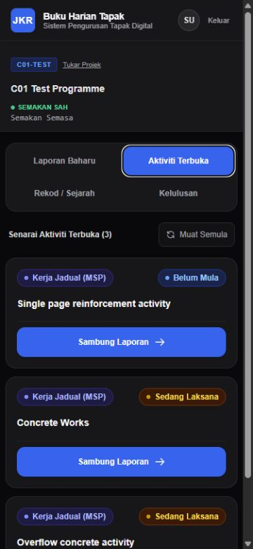
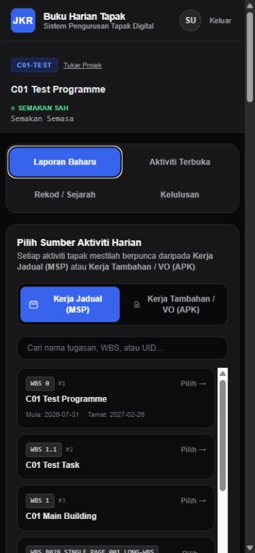
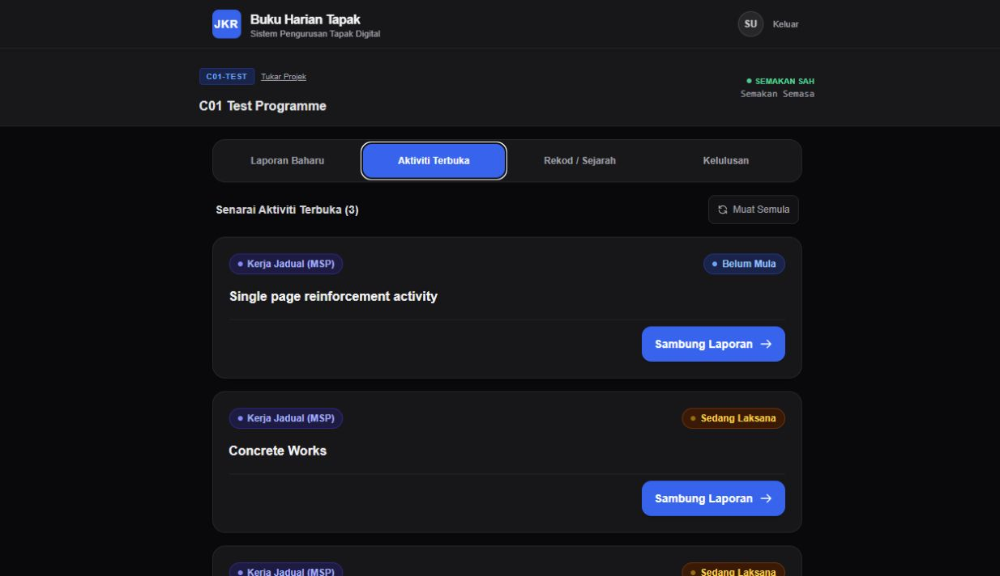
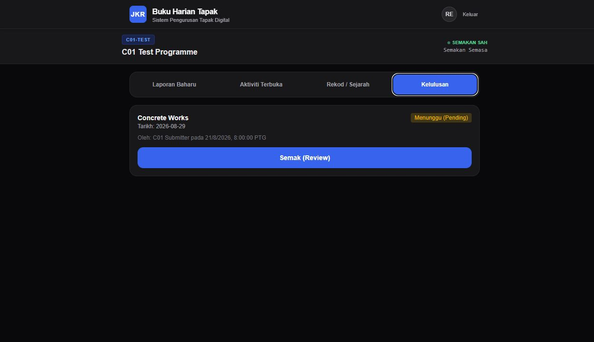

# F4.5-B01A — Styling Pipeline Recovery Report

## Authority and scope

- Repository: `jenggon/jkr-site-diary`
- Authoritative branch: `develop`
- Required and verified base SHA: `aae4d32e8dd94d4b2a053f59846bd3686a945ab4`
- Implementation branch: `feature/F4.5-B01A-styling-pipeline`
- Scope: styling compilation recovery only. No screen redesign or product-semantic change is included.

The implementation began only after `git fetch origin`, `git checkout develop`, and `git pull --ff-only origin develop` completed and `HEAD` matched the required SHA. The stale F4.5-A01 checkout at `b2277db...` was not used as the baseline.

## Why the styling pipeline was inert

The source already declared a substantial Tailwind v3-style utility vocabulary, but the repository did not provide the compiler path needed to turn those class names into CSS:

- `postcss.config.mjs` declared an empty `plugins` object;
- `src/app/globals.css` did not include Tailwind base, components, or utilities directives;
- no Tailwind content configuration scanned application/component source;
- Tailwind, PostCSS, and Autoprefixer were not declared as project development dependencies.

Consequently, class strings remained in the rendered markup while their utility rules and Preflight reset were absent from the built stylesheet. Browser defaults such as the body margin and native control styling therefore remained authoritative.

## Dependency and configuration changes

The recovery uses the smallest conventional Tailwind v3/PostCSS pipeline compatible with the vocabulary already present in the repository. It deliberately does not adopt Tailwind v4 or rewrite existing class strings.

Exact development dependencies added with pnpm and recorded in both `package.json` and `pnpm-lock.yaml`:

| Package | Exact version | Reason |
| --- | ---: | --- |
| `tailwindcss` | `3.4.17` | Mature v3 compiler compatible with the repository's existing directive and utility vocabulary. |
| `postcss` | `8.4.31` | Deterministic PostCSS runner compatible with the installed Next.js 15 pipeline. |
| `autoprefixer` | `10.4.20` | Deterministic browser-prefix processing for generated and existing CSS. |

Configuration and stylesheet changes:

- `postcss.config.mjs` now runs `tailwindcss` followed by `autoprefixer`.
- `tailwind.config.cjs` scans `./src/**/*.{js,ts,jsx,tsx,mdx}`, covering all current `src/app/**` routes and relevant components under `src/**`.
- The config defines compatibility shades for the already-declared `zinc-650` and `zinc-850` tokens so those source classes compile without rewrites.
- `src/app/globals.css` now loads `@tailwind base`, `@tailwind components`, and `@tailwind utilities` before the repository's existing global rules.
- Tailwind Preflight restores the baseline/reset, including zero browser-default body margin and inherited control typography.

No existing utility class was rewritten for visual preference.

## Print renderer preservation

The official renderer and its embedded print CSS were not edited. The Git blob hash for `src/app/site-diary/print/PrintSiteDiaryClient.tsx` is identical at the authoritative base and in this branch:

```text
c30dd97f75d0c168976cd8f29a3f7bb0ec684bda
```

This preserves official JKR Page 1, continuation, pagination, and embedded print semantics exactly.

## Runtime visual inspection

The production build was run against the repository's localhost-only Supabase stack (`127.0.0.1`). The committed additive synthetic fixture was loaded because the read-only precheck found zero synthetic users and zero fixture programmes. No production host or production data was contacted.

Inspected at mobile `375 × 812` and desktop `1280 × 720`:

- login;
- Site Diary shell and programme workspace;
- workspace navigation;
- New Entry;
- MSP/VO source selector;
- Open Activities;
- Records surface;
- Approval surface using the local reviewer fixture.

The Records surface returned the existing runtime message `Missing or invalid query parameter: programmeId` for both local personas. This was recorded as part of the truthful baseline and was not changed because API/product behavior is outside B01A. The accessible Approval surface was used for the required desktop evidence.

## Computed-style proof

Representative runtime elements were measured with browser computed styles in the real production application:

| Requirement | Declared class | Mobile `375 × 812` | Desktop `1280 × 720` |
| --- | --- | --- | --- |
| Flex | `flex` | `display: flex` | `display: flex` |
| Grid | `grid` | `display: grid` | `display: grid` |
| Background color | `bg-zinc-950` | `rgb(9, 9, 11)` | `rgb(9, 9, 11)` |
| Border radius | `rounded-2xl` | `16px` | `16px` |
| Max width | `max-w-3xl` | `768px` | `768px` |
| Sticky positioning | `sticky` | `position: sticky` | `position: sticky` |
| Responsive layout | `sm:grid-cols-4` | two columns (`165px 165px`) | four columns (`178.5px` each) |
| Minimum touch sizing | `min-h-[44px]` | `min-height: 44px` | `min-height: 44px` |
| Reset baseline | Preflight on `body` | `margin: 0px` | `margin: 0px` |

The production compilation also emitted the existing custom compatibility utilities `placeholder-zinc-650` and `border-zinc-850`.

## Visual evidence

### Mobile Site Diary workspace — 375 × 812



### Mobile Daily Entry / source selection — 375 × 812



### Desktop Site Diary workspace — 1280 × 720



### Desktop Approval surface — 1280 × 720



These are screenshots of the real local production runtime after pipeline recovery; they are not generated mockups.

## Regression coverage and verification

Focused contract coverage was added in `tests/contract/f45B01AStylingPipeline.contract.test.ts` for:

- exact pinned styling dependencies under pnpm;
- Tailwind and Autoprefixer PostCSS registration;
- complete `src/**` content scanning and compatibility shades;
- global loading of Preflight, components, and utilities.

Results:

| Gate | Result |
| --- | --- |
| `pnpm install --frozen-lockfile` | PASS — lockfile current and deterministic |
| Focused styling contract | PASS — 4 tests |
| `pnpm run verify` | PASS |
| TypeScript validation | PASS |
| API-inclusive TypeScript validation | PASS |
| Lint | PASS with one pre-existing warning in the unchanged print renderer |
| Full automated suite | PASS — 138 files, 1,129 tests |
| Production build | PASS — 29 static pages generated and route build completed |
| `git diff --check` | PASS |

## Product-semantic confirmation

No business logic, API calls, database schema, RBAC/RLS, Programme/Revision semantics, MSP XOR VO behavior, Activity/Site Diary lifecycle, approval authority, official JKR Page 1, or continuation rule was changed. `BottomNavigation.tsx` and `SearchPicker.tsx` were not removed or refactored. No tactical/Gen-Z redesign was implemented.

B01A therefore exposes the latent presentation already declared by the existing source and stops at the styling baseline for HQ/User visual review.
