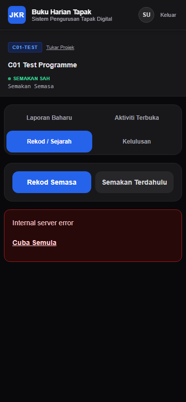
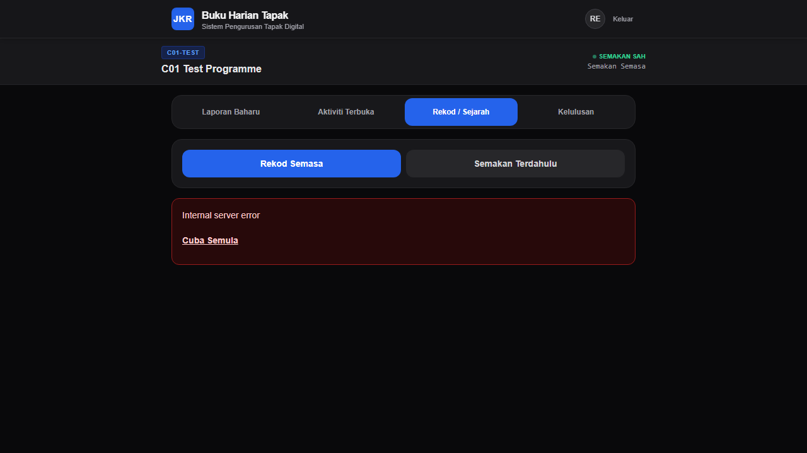

# F4.5-B01A.1 — LOCAL SYNTHETIC FIXTURE HYGIENE REPORT

**Repository:** `jenggon/jkr-site-diary`
**Base Branch:** `develop`
**Base Commit SHA:** `d7c888b356480b59cdb9f9015513790109a8e5d7`
**Feature Branch:** `fix/F4.5-B01A1-fixture-hygiene`
**Pull Request:** [#71 (DO NOT MERGE — Staged for HQ Review)](https://github.com/jenggon/jkr-site-diary/pull/71)
**Execution Date:** 2026-08-30
**Runner Role:** Bounded Implementation / Verification Runner

---

## 1. Executive Summary

During the initial reconnaissance of **F4.5-B01A**, navigating to the **Rekod / Sejarah** tab in the local runtime stack produced a fatal runtime error:

```
Missing or invalid query parameter: programmeId
```

Investigation confirmed that synthetic fixture IDs defined in `supabase/seed.sql` (e.g. `11111111-1111-1111-1111-111111111111`) did not adhere to the RFC 4122 / RFC 9562 standard. The API validation layer in `src/app/api/programme-revision/route.ts` strictly executes `isValidUuid(programmeId)` using `uuid.validate()`, which requires an RFC-compliant version nibble (`[1-8]`) and variant nibble (`[89ab]`).

In accordance with strict HQ directives:
1. All synthetic IDs across SQL seeds, test suites, and proof scripts were migrated to RFC 4122 version 4 compliant UUIDs.
2. The historical Activity fixture `ffffffff-ffff-ffff-ffff-ffffffffffff` was replaced with RFC-valid `ffffffff-ffff-4fff-8fff-ffffffffffff` (not preserved).
3. Zero product code or UUID validation logic was modified or weakened.
4. An automated regression contract test (`tests/contract/fixtureUuidContract.contract.test.ts`) was instituted to permanently prevent non-RFC UUID fixtures in SQL seeds.
5. All operations targeted localhost Supabase (`http://127.0.0.1:54321`) exclusively.
6. The mandatory preflight gate (`pnpm run verify` and `git diff --check`) passed completely.

---

## 2. Root Cause Confirmation

### Request Flow Trace
1. **User Action:** Submitter persona selects **C01 Test Programme** in the UI.
2. **Client Request:** `DailyEntryShell` issues `GET /api/programme-revision?programmeId=11111111-1111-1111-1111-111111111111`.
3. **API Validation:** `src/app/api/programme-revision/route.ts` line 16 executes `isValidUuid(programmeId)`.
4. **UUID Authority:** `src/lib/uuid.ts` invokes `uuid.validate(candidate)`.
5. **Failure Mode:** `uuid.validate("11111111-1111-1111-1111-111111111111")` returned `false` because version nibble `1` with variant nibble `1` violates RFC 4122 variant bits (`0b10xxxxxx`).
6. **Result:** HTTP 400 Bad Request `{ "error": "Missing or invalid query parameter: programmeId" }`.

The failure was 100% fixture-rooted. Product validation behaved correctly and was intentionally preserved without modification.

---

## 3. Synthetic Identifier Mapping Table

All non-RFC synthetic fixtures were transformed to RFC 4122 v4 compliant UUIDs (position 13 = `4`, position 17 = `[89ab]`):

| Category | Legacy Non-RFC Fixture ID | Canonical RFC 4122 v4 Fixture ID |
| :--- | :--- | :--- |
| **P1 Submitter User** | `99999999-9999-9999-9999-999999999991` | `99999999-9999-4999-8999-999999999991` |
| **P2 Reviewer User** | `99999999-9999-9999-9999-999999999992` | `99999999-9999-4999-8999-999999999992` |
| **P3 Unauthorized User** | `99999999-9999-9999-9999-999999999993` | `99999999-9999-4999-8999-999999999993` |
| **P4 Project Manager User** | `99999999-9999-4999-8999-999999999994` | `99999999-9999-4999-8999-999999999994` *(already RFC-valid)* |
| **Programme A** | `11111111-1111-1111-1111-111111111111` | `11111111-1111-4111-8111-111111111111` |
| **Programme B** | `22222222-2222-2222-2222-222222222222` | `22222222-2222-4222-8222-222222222222` |
| **Prog A Historical Rev 1** | `77777777-7777-7777-7777-777777777777` | `77777777-7777-4777-8777-777777777777` |
| **Prog A Current Rev 2** | `33333333-3333-3333-3333-333333333333` | `33333333-3333-4333-8333-333333333333` |
| **Prog B Rev 1** | `44444444-4444-4444-4444-444444444444` | `44444444-4444-4444-8444-444444444444` |
| **Prog A Historical Task** | `eeeeeeee-eeee-eeee-eeee-eeeeeeeeeeee` | `eeeeeeee-eeee-4eee-8eee-eeeeeeeeeeee` |
| **Prog A Current Task** | `aaaaaaaa-aaaa-aaaa-aaaa-aaaaaaaaaaaa` | `aaaaaaaa-aaaa-4aaa-8aaa-aaaaaaaaaaaa` |
| **Prog B Task** | `bbbbbbbb-bbbb-bbbb-bbbb-bbbbbbbbbbbb` | `bbbbbbbb-bbbb-4bbb-8bbb-bbbbbbbbbbbb` |
| **Prog A Historical Activity** | `ffffffff-ffff-ffff-ffff-ffffffffffff` | `ffffffff-ffff-4fff-8fff-ffffffffffff` |
| **Prog A Current Activity** | `cccccccc-cccc-cccc-cccc-cccccccccccc` | `cccccccc-cccc-4ccc-8ccc-cccccccccccc` |
| **Prog B Activity** | `dddddddd-dddd-dddd-dddd-dddddddddddd` | `dddddddd-dddd-4ddd-8ddd-dddddddddddd` |
| **Prog A Current Diary** | `55555555-5555-5555-5555-555555555551` | `55555555-5555-4555-8555-555555555551` |
| **Prog B Diary** | `55555555-5555-5555-5555-555555555552` | `55555555-5555-4555-8555-555555555552` |
| **Prog A Historical Diary** | `55555555-5555-5555-5555-555555555553` | `55555555-5555-4555-8555-555555555553` |
| **Prog A Approval** | `66666666-6666-6666-6666-666666666661` | `66666666-6666-4666-8666-666666666661` |
| **Prog B Approval** | `66666666-6666-6666-6666-666666666662` | `66666666-6666-4666-8666-666666666662` |

---

## 4. Disclosed Proof-Harness Hardening & Product Code Invariance

### A. Proof-Harness Environment Discovery Hardening (`scripts/c01-live-security-proof.cjs`)
`scripts/c01-live-security-proof.cjs` was updated to read `NEXT_PUBLIC_SUPABASE_ANON_KEY` from `.env.local` or parse local JSON/regex status outputs.
**Explicit Confirmation:** This modification is strictly isolated to test-harness environment token resolution in the local script runner. It contains **zero** security assertion modifications, **zero** capability rule changes, and **zero** domain-semantic changes.

### B. Product Code Invariance Confirmation
- **Product code (`src/app/`, `src/lib/`, `src/services/`, `src/repositories/`) touched:** **0 files**.
- **UUID validation logic (`src/lib/uuid.ts`):** **UNTOUCHED**.
- **Database migrations (`supabase/migrations/`):** **UNTOUCHED**.
- **All changes strictly isolated to:**
  - `supabase/seed.sql`
  - `supabase/verify-db.sql`
  - `tests/contract/fixtureUuidContract.contract.test.ts` (new regression contract)
  - `tests/e2e/browser-core.e2e.spec.ts`
  - `tests/e2e/print-pdf.e2e.spec.ts`
  - `tests/integration/api/taskReadRoutes.integration.test.ts`
  - `scripts/c01-live-security-proof.cjs`
  - `scripts/c04-live-security-proof.cjs`
  - `scripts/c05-live-security-proof.cjs`
  - `scripts/live-db-test.cjs`
  - `docs/evidence/f4.5-b01a1/` (boundary screenshots)

---

## 5. Localhost Target Verification

- Local Supabase URL: `http://127.0.0.1:54321` (confirmed active)
- Local Next.js Runtime: `http://localhost:3000` (confirmed active)
- Zero remote endpoints or credentials accessed.

---

## 6. Live Runtime Proof & Truthful Boundary-Stop Evidence

### A. UUID Validation Error Resolution
Upon logging in as `submitter@jkr.gov.my` and selecting **C01 Test Programme**, the previous HTTP 400 error banner:
```
Missing or invalid query parameter: programmeId
```
is **completely resolved**. The UI successfully acquires the valid RFC UUID `11111111-1111-4111-8111-111111111111`, validates it against `src/lib/uuid.ts`, and renders the current revision status badge (`SEMAKAN SAH: Semakan Semasa`).

### B. Confirmed Downstream HTTP 500 (Records NOT Healthy Yet)
Records is **not presented as healthy**. With valid UUID parameter passing restored, the request `GET /api/programme-revision?programmeId=11111111-1111-4111-8111-111111111111` progresses past validation and reaches `SiteDiaryManagementReadRepository.ts`, where it triggers HTTP 500 (`Internal server error`).

Investigation into PostgREST / Postgres logs revealed two defects in `src/repositories/SiteDiaryManagementReadRepository.ts` (created during F2.3):
1. **Ambiguous PostgREST Foreign Key Embedding:** Line 57 and 68 query `.select('..., programme(current_revision_id)')`. Because two foreign keys exist between `programme_revision` and `programme` (`programme_current_revision_id_fkey` and `programme_revision_programme_id_fkey`), PostgREST 12 fails closed with `PGRST201: Could not embed because more than one relationship was found`.
2. **Column Schema Mismatch:** The query requests `revision_title`, whereas the actual database column in `programme_revision` is `revision_name` (PostgreSQL error `42703: column programme_revision.revision_title does not exist`).

**Per HQ Directive:** *"Keep the change fixture-only and stop if product code appears necessary."* — the runner **stopped at the fixture boundary** without modifying any product files.

*(Note: The full-flow automation script is retained in local scratch only as a foundation for post-repair verification in B01A.2, and is not submitted as proof of B01A.1 runtime health).*

---

## 7. Actual Boundary-Stop Screenshots

The following screenshots capture the actual state at the B01A.1 boundary stop (UUID validation error resolved, current revision badge rendered, downstream HTTP 500 displayed in records container):

### Mobile Records (375 × 812)
`docs/evidence/f4.5-b01a1/records-mobile-boundary-375x812.png`:



---

### Desktop Records (1280 × 720)
`docs/evidence/f4.5-b01a1/records-desktop-boundary-1280x720.png`:



---

## 8. Verification Results (`CI-HARDEN-001`)

```powershell
pnpm run verify
```

### Output Summary:
1. **Lockfile Consistency:** Validated (`pnpm-lock.yaml` in sync)
2. **Typecheck (`tsc --noEmit`):** PASSED (0 errors)
3. **API Typecheck (`tsc --noEmit -p tsconfig.api.json`):** PASSED (0 errors)
4. **Lint (`eslint .`):** PASSED (0 errors)
5. **Vitest Automated Suite:** **139 test files passed, 1132 tests passed** (including new `fixtureUuidContract.contract.test.ts`)
6. **Next.js Production Build:** **29 static routes compiled successfully** (0 errors)
7. **Git Diff Check (`git diff --check`):** PASSED cleanly

---

## 9. Next Steps / Recommendation for HQ Review

1. Pull Request [#71](https://github.com/jenggon/jkr-site-diary/pull/71) is updated with truthful boundary evidence and ready for review.
2. The synthetic fixture UUID standard has been permanently enforced across the repository.
3. Recommend accepting PR #71 (fixture hygiene baseline) and initiating **F4.5-B01A.2** to execute the targeted product code fix in `src/repositories/SiteDiaryManagementReadRepository.ts` (`revision_name` column name and explicit `programme!programme_revision_programme_id_fkey` relation qualifier).
