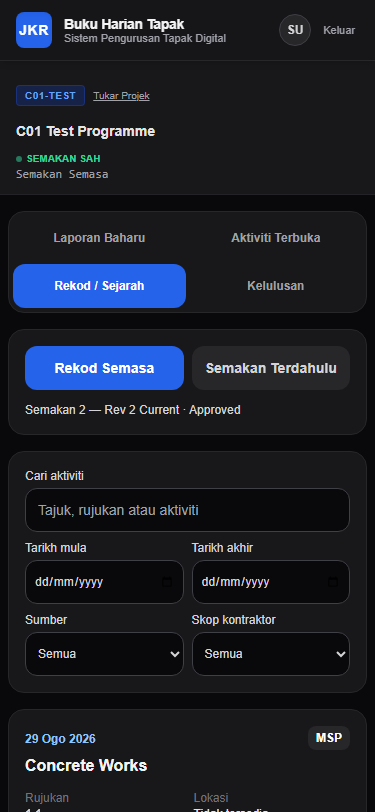
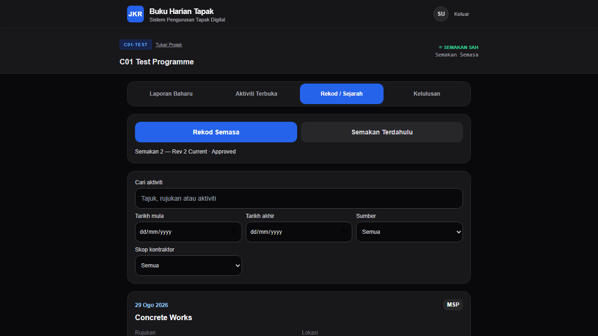
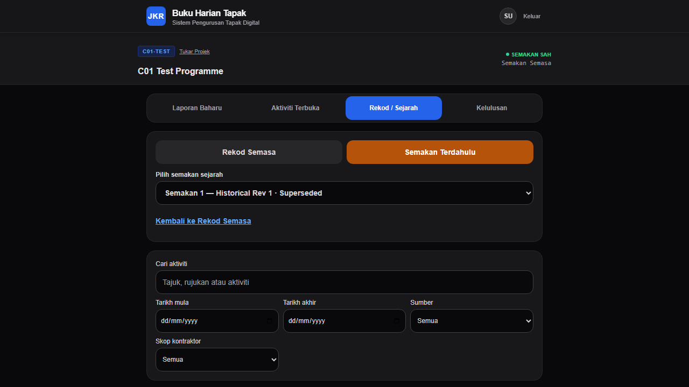

# F4.5-B01A.2 — RECORDS READ REPOSITORY REPAIR REPORT

**Date:** 2026-08-30  
**Authoritative Branch:** `develop`  
**Feature/Fix Branch:** `fix/F4.5-B01A2-records-read-repository`  
**Base HEAD:** `d7d9b5aa24ea294f92f5490c841413ac142ba9a8`  
**Gate Status:** **PASSED (`pnpm run verify` complete green)**  

---

## 1. Executive Summary

During verification of F4.5-B01A.1 (Synthetic Fixture UUID Hygiene), runtime testing exposed a downstream HTTP 500 error when opening the **Rekod / Sejarah** (Records) view in Site Diary.

Root cause analysis confirmed two structural defects in `src/repositories/SiteDiaryManagementReadRepository.ts`:
1. **Schema Column Mismatch:** The query projected `revision_title`, whereas the authoritative PostgreSQL schema column in table `programme_revision` is `revision_name`.
2. **Ambiguous PostgREST Foreign Key Embedding:** The query projected `programme(current_revision_id)`. Because two foreign keys exist between `programme` and `programme_revision` (`programme_revision_programme_id_fkey` and `programme_current_revision_id_fkey`), PostgREST raised a `PGRST201: Could not embed because more than one relationship was found` error.

This mission applied tightly bounded product-code fixes to the repository and service layers, added contract and unit test suites, verified full operational semantics via Playwright runtime tests, and captured evidence screenshots from localhost runtime.

---

## 2. Technical Changes

### 2.1 Repository Layer (`src/repositories/SiteDiaryManagementReadRepository.ts`)
- Updated `ManagementRevisionRow` interface to expose authoritative `revision_name: string | null` (retaining `@deprecated revision_title?: string` for backward compatibility with legacy test mocks).
- Updated `findRevision()` and `findRevisions()` select projections to use the disambiguated PostgREST foreign key qualifier and authoritative column:
  ```typescript
  const REVISION_PROJECTION =
    'revision_id, programme_id, revision_no, revision_name, status, programme!programme_revision_programme_id_fkey(current_revision_id)';
  ```
- Retained fail-closed exception throwing on query errors.

### 2.2 Service Layer (`src/services/SiteDiaryManagementReadService.ts`)
- Updated `mapRevision()` helper to map `row.revision_name ?? row.revision_title ?? ''` to the public domain/API field `revisionTitle`.
- Maintained exact domain contract `SiteDiaryManagementRevision` and `SiteDiaryManagementProjection` for all callers (`DiaryManagementList.tsx`, API route `GET /api/programme-revision`).

### 2.3 Automated Test Coverage
- **Repository Unit Tests (`tests/unit/repositories/SiteDiaryManagementReadRepository.test.ts`):**
  - Verified `findRevision()` uses authoritative `revision_name` and explicit FK qualifier `programme!programme_revision_programme_id_fkey(current_revision_id)`.
  - Verified `findRevisions()` queries all revisions ordered by `revision_no` descending.
  - Verified fail-closed error handling for database failures.
- **Service Unit Tests (`tests/unit/services/SiteDiaryManagementReadService.test.ts`):**
  - Verified domain mapping from `revision_name` to `revisionTitle`.
  - Verified single current revision resolution (`isCurrentRevision: true`, `isReadOnly: false`).
  - Verified historical revision distinction (`isCurrentRevision: false`, `isReadOnly: true`).
- **Contract Tests (`tests/contract/recordsReadRepository.contract.test.ts`):**
  - Verified repository query composition, schema column fidelity, unambiguous FK qualification, and fail-closed error propagation.

---

## 3. Local Runtime Verification

Local runtime verification was executed against the clean localhost Supabase instance using Playwright automation (`scratch/verify-b01a2.cjs`):

| Test Scenario | Viewport | Persona | Result |
| :--- | :--- | :--- | :--- |
| **Mobile Current Records** | 375 × 812 | Submitter (`submitter@jkr.gov.my`) | **PASS** — Current revision badge visible (`Semakan 2 — Rev 2 Current · Approved`), 3 records loaded, 0 error alerts |
| **Desktop Current Records** | 1280 × 720 | Submitter (`submitter@jkr.gov.my`) | **PASS** — Current revision badge visible, 3 records loaded, 0 error alerts |
| **Desktop Historical Records** | 1280 × 720 | Submitter (`submitter@jkr.gov.my`) | **PASS** — Historical revision selected (`Semakan 1 — Historical Rev 1 · Superseded`), historical records loaded, 0 error alerts |
| **New Entry Workflow** | 1280 × 720 | Submitter (`submitter@jkr.gov.my`) | **PASS** — Operational Source Selector (`Kerja Jadual (MSP)` / `Kerja Tambahan / VO`) visible, 0 error alerts |
| **Approval Workflow** | 1280 × 720 | Reviewer (`reviewer@jkr.gov.my`) | **PASS** — Pending approval item (`Concrete Works`) and Review action control visible, 0 error alerts |

---

## 4. Visual Evidence

Real runtime screenshots captured from localhost:

### 4.1 Mobile Records View (375 × 812)


### 4.2 Desktop Current Records View (1280 × 720)


### 4.3 Desktop Historical Records View (1280 × 720)


---

## 5. Verification Gate Contract (`CI-HARDEN-001`)

The mandatory preflight gate was executed on `fix/F4.5-B01A2-records-read-repository`:

```bash
pnpm run verify
```

### Preflight Results
1. **TypeScript (`tsc --noEmit`):** PASSED (0 errors)
2. **API TypeScript (`tsc --noEmit -p tsconfig.api.json`):** PASSED (0 errors)
3. **ESLint (`eslint .`):** PASSED (0 errors)
4. **Vitest Suite (`vitest run`):** PASSED (140 files, 1,141 tests passed)
5. **Production Build (`next build`):** PASSED (29 routes optimized and generated)
6. **Whitespace / Diff Check (`git diff --check`):** PASSED (0 errors)

---

## 6. Architecture & Governance Compliance

- **DB-014 / DB-015:** Preserved canonical Activity and Site Diary ownership.
- **REM-007:** Preserved single current revision authority; historical revisions remain read-only.
- **Domain Invariants:** No schema migrations, no breaking API changes, no UI redesign.
- **Status:** Ready for Pull Request and HQ Review. **DO NOT MERGE.**
