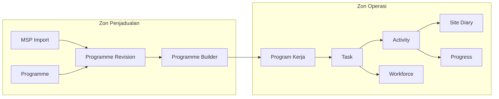

# AD-001: Domain Map

**Project:** JKR Site Diary Platform
**Version:** 1.0.0

Status: Locked

## Purpose

Illustrate the high-level domain boundaries of the JKR Site Diary Platform.

## Domain Map

## Notes

- Zon Penjadualan manages planning activities.
- Program Kerja is the operational boundary.
- Zon Operasi executes approved work packages.
