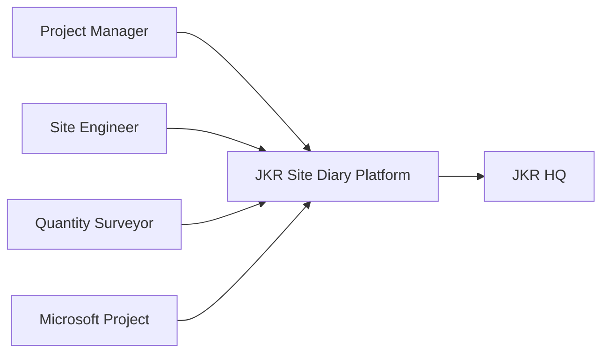

# AD-002: System Context

Status: Active

## Purpose

Describe how external actors interact with the JKR Site Diary Platform.

## Context Diagram

## Notes

- Microsoft Project supplies scheduling information.
- HQ receives validated operational information.