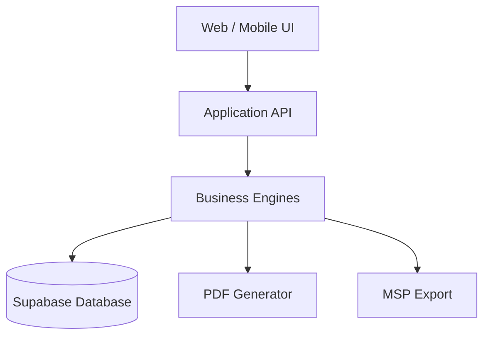

# AD-003: Container Diagram

Status: Active

## Purpose

Show the major containers of the platform.

## Container Diagram

## Notes

Business logic resides within the Business Engines layer.

Persistence is managed by Supabase.