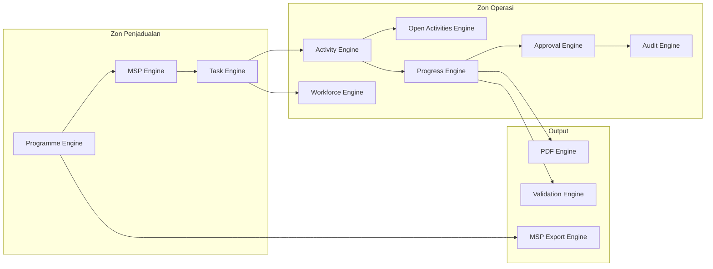

# AD-004: Component Diagram

Status: Active

## Purpose

Illustrate the internal business components of the JKR Site Diary Platform and their relationships.

## Component Diagram

## Notes

- Programme Engine orchestrates planning activities.
- MSP Engine manages Microsoft Project integration.
- Task Engine creates operational work packages.
- Activity Engine records execution.
- Open Activities Engine manages unfinished work across reporting periods.
- Progress Engine consolidates site progress.
- Workforce Engine records manpower allocation.
- Approval Engine validates operational submissions.
- Audit Engine maintains immutable audit records.
- Output Engines generate reports and exports.