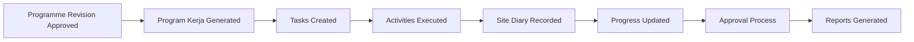

# AD-005: Operational Flow

Status: Active

## Purpose

Illustrate the end-to-end operational workflow after a Programme Revision has been approved.

## Operational Flow

## Notes

- Operational activities begin only after Programme approval.
- Program Kerja is the operational baseline.
- Progress is continuously updated throughout execution.