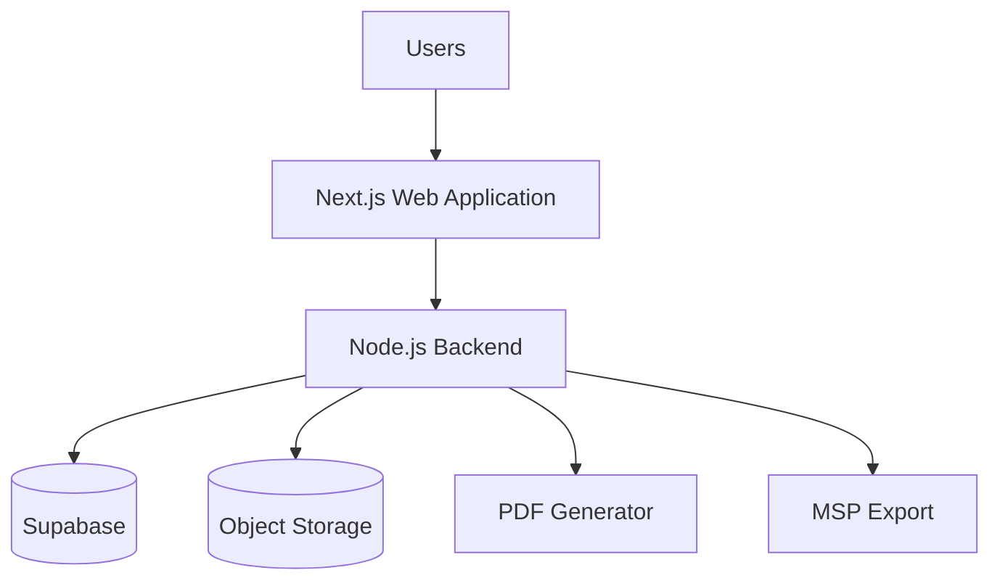

# AD-006: Deployment Overview

**Project:** JKR Site Diary Platform
**Version:** 1.0.0

Status: Locked

## Purpose

Illustrate the deployment architecture of the JKR Site Diary Platform.

## Deployment Diagram

## Notes

- Users access the system through a web interface.
- Business logic resides in the backend.
- Supabase stores operational data.
