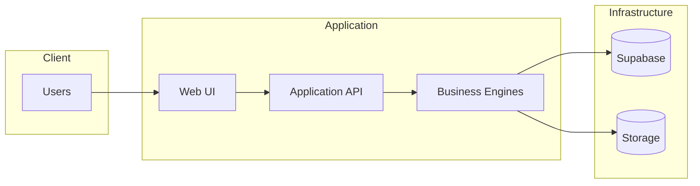

# AD-008: Security Boundary

**Project:** JKR Site Diary Platform
**Version:** 1.0.0

Status: Locked

## Purpose

Define security boundaries within the platform.

## Security Boundary

## Notes

- All database access is performed through the Application API.
- Business Engines enforce authorization and validation.
