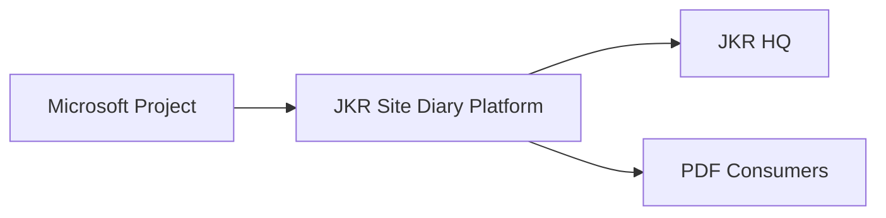

# AD-009: Integration Context

**Project:** JKR Site Diary Platform
**Version:** 1.0.0

Status: Locked

## Purpose

Illustrate external integrations.

## Integration Context

## Notes

- Microsoft Project provides planning data.
- HQ consumes operational information.
- PDF reports are generated by the platform.
