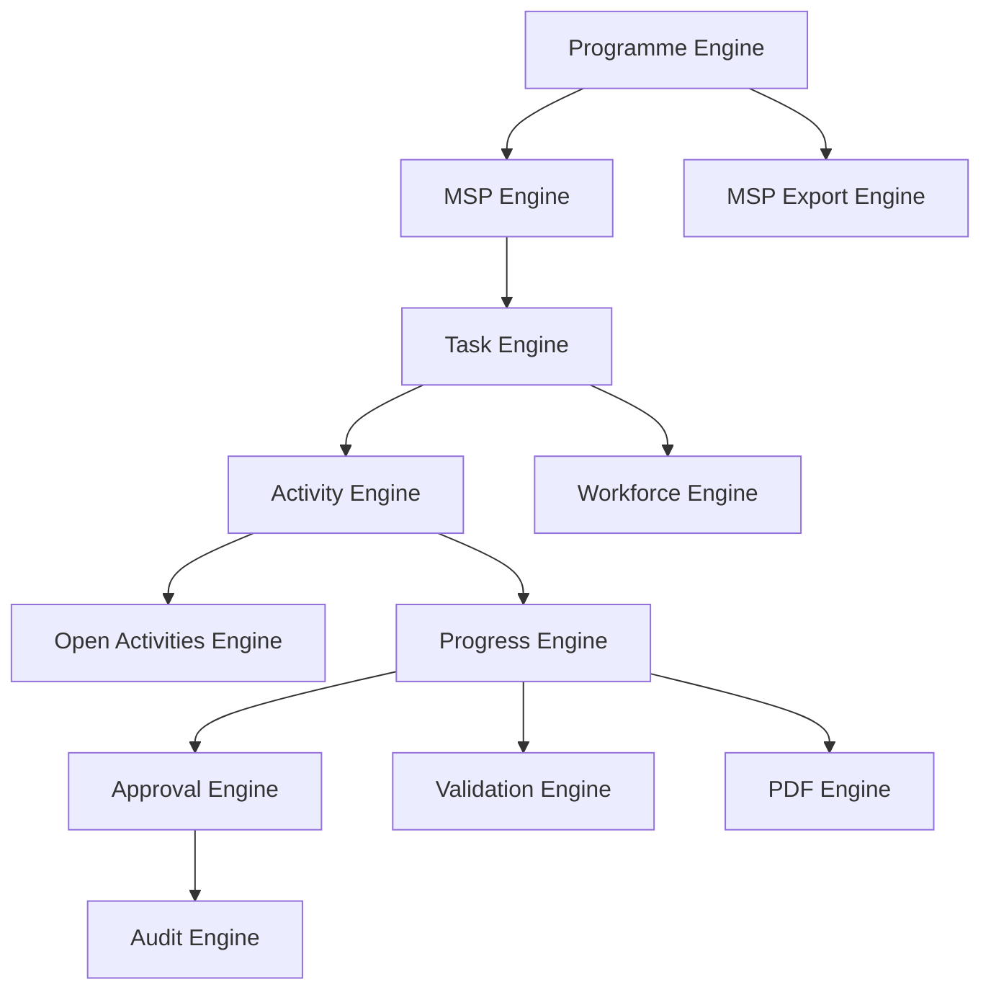

# AD-010: Engine Relationship

Status: Active

## Purpose

Illustrate relationships among all core engines.

## Engine Relationship

## Notes

- Programme Engine is the entry point for planning.
- Operational engines execute approved work.
- Output engines generate reports and exports.